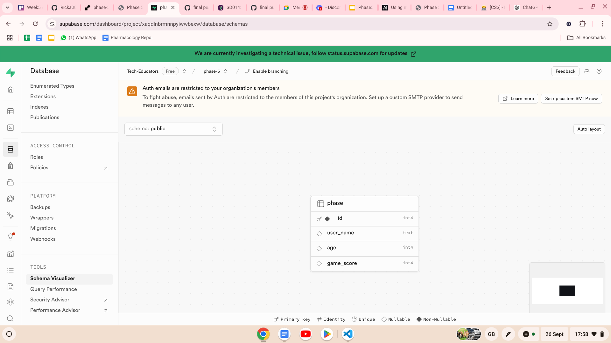

Client link: [render link](https://phase-5-1.onrender.com)  
Server link: [render link](https://phase-5-olau.onrender.com)

  
  
  

## User Stories

Gaming app – User story – week 5 game

- The user answers the questions and the results are published to a leaderboard

- The user counts the number of (a certain item) within the image and submits the number

- The user has a certain number of levels to complete

- The user cannot go to the next level without submitting the correct answer (maybe a do not display event listener)

## Stretch goals

- More than 3 levels
- If they get correct answer, the user gets a reaction / animation / background colour changes
- Drag and drop levels

## Problem Domain

- Phase 5 provides a place for relaxation and gratification of completing levels
- easy to play, requires minimal effort, and provides a sense of progress and accomplishment as players reach new levels or earn rewards
- The interactive elements of the games help stimulate your brain and is beneficial for all ages, particularly 6-10.

## Team reflections

- Anthony

Were there any requirements or goals that you were unable to achieve?

If so, what was it that you found difficult about these tasks?

What errors or bugs did you encounter while completing your assignment? How did you solve them?

Resources used and for what topics:

- Kat

Were there any requirements or goals that you were unable to achieve?

If so, what was it that you found difficult about these tasks?

What errors or bugs did you encounter while completing your assignment? How did you solve them?  
Github conflicts, fetch errors and so many bugs. Debugged as a team

Resources used and for what topics:  
stackoverflow: arrays and getting the next item in the array  
YT: LearnWebCode: help with questions and scoring, progress bar and blurring the win/lose alerts.

- Khadija

Were there any requirements or goals that you were unable to achieve?

If so, what was it that you found difficult about these tasks?

What errors or bugs did you encounter while completing your assignment? How did you solve them?

Resources used and for what topics:

- Serdrick

Were there any requirements or goals that you were unable to achieve?

If so, what was it that you found difficult about these tasks?

What errors or bugs did you encounter while completing your assignment? How did you solve them?

Resources used and for what topics:
